# LSTM Networks with CTC Loss Applied to Gesture Typing Decoding

**Willians Cassiano de Freitas Abreu**

Undergraduate thesis (B.Sc. in Software Engineering), Institute of Computing, Federal University of Amazonas (UFAM), Brazil, 2018.
Advisor: Prof. Marco Antônio Pinheiro de Cristo. Co-advisor: Prof. Juan Gabriel Colonna.

> This is a Markdown version of the English translation, for reading on GitHub. For the typeset version, see the [PDF](Undergraduate%20Thesis%20Text%20(English).pdf). The original Portuguese text is also available as a [PDF](Undergraduate%20Thesis%20Text%20(Portuguese).pdf). The figures are the originals, so some plots have Portuguese labels.

## Abstract

The gesture typing problem was first approached in the 1980s, as a data entry alternative more efficient than key-by-key typing. Since then, with the growing popularity of mobile devices, this kind of interaction has become increasingly common. Compared to traditional methods, this form of input is noisier, in the sense that the same input signal can be interpreted in different ways. Thus, new methods for this type of input have been proposed with the aim of improving recognition under the most diverse conditions of use and user characteristics. Among these methods, one that has been particularly successful, due to its well-known robustness to noise, is recurrent neural networks. In this work, we implement a model that recognizes words typed with gestures, based on a state-of-the-art method that employs an RNN with memory, that is, with LSTM (Long Short-Term Memory) cells. In addition, to provide training data for the model, we also implement a gesture synthesis model capable of producing the gestures corresponding to the words a user would type, as similar as possible to those that would be captured from real input produced by a human being. We train and evaluate the implemented model on a lexicon of about 62 thousand words, using a cost function that evaluates the complete sequence of recognized characters of the word (CTC — Connectionist Temporal Classification). Finally, we decode the resulting probabilities using a finite state transducer (FST) built from a Trie obtained from the lexicon, by means of an approximate search algorithm, Beam Search. The implemented model achieved a performance compatible with that reported in the literature, with about 97% correct recognition for the evaluated task.

**Keywords:** gesture typing, LSTM, connectionist temporal classification, gesture synthesis.

## Contents

- [1 Introduction](#1-introduction)
  - [1.1 Problem definition](#11-problem-definition)
  - [1.2 Objectives](#12-objectives)
  - [1.3 Motivation](#13-motivation)
  - [1.4 Main contributions](#14-main-contributions)
- [2 Theoretical background and literature review](#2-theoretical-background-and-literature-review)
  - [2.1 Gesture typing](#21-gesture-typing)
  - [2.2 Recognition algorithms](#22-recognition-algorithms)
  - [2.3 LSTM networks](#23-lstm-networks)
  - [2.4 *Connectionist Temporal Classification*](#24-connectionist-temporal-classification)
  - [2.5 Finite state transducers and *Beam Search*](#25-finite-state-transducers-and-beam-search)
  - [2.6 Gesture synthesis models](#26-gesture-synthesis-models)
- [3 Gesture Synthesis and Decoding](#3-gesture-synthesis-and-decoding)
  - [3.1 LSTM network with CTC cost](#31-lstm-network-with-ctc-cost)
  - [3.2 Feature extractor](#32-feature-extractor)
  - [3.3 Synthesis](#33-synthesis)
- [4 Experiments and Results](#4-experiments-and-results)
  - [4.1 Experimental methodology](#41-experimental-methodology)
  - [4.2 Word recognition](#42-word-recognition)
  - [4.3 The effects of the synthesizer on recognition errors](#43-the-effects-of-the-synthesizer-on-recognition-errors)
  - [4.4 Portuguese word recognition with transfer learning](#44-portuguese-word-recognition-with-transfer-learning)
- [5 Conclusion and future work](#5-conclusion-and-future-work)
- [References](#references)

## 1 Introduction

Despite the advances in multimedia technologies, writing is still the main form of digital communication between people, accounting for a large share of the traffic on the world wide web. For roughly four fifths of the history of the internet, this content originated mostly from physical keyboards connected to desktop computers.

With the improvement of mobile technologies and their adoption by the general public, new interaction methods could be developed, taking advantage of the flexibility of these new platforms. As examples, we can mention the use by applications of geolocation, accelerometers, gyroscopes, heart rate sensors, presence technologies and – of most interest to this work – *touchscreens*.

Touch-sensitive screens introduced a whole range of new interactions. One of the applications of these new interaction methods is gesture typing, which aims to increase user performance by allowing one or more words to be entered with a single first-order gesture on the sensitive surface of the device. Compared to traditional input methods, such as key-by-key typing, the user is expected to be able to provide input with less physical effort and greater speed.

However, although the gesture keyboard is more efficient than its physical counterpart in a *mobile* context, decoding gestures into words is considerably more complex than simple collision checking on a regular *touchscreen* keyboard.

This happens because, in addition to the errors inherent to a normal input process (grammatical errors, cognitive errors, phonetic confusion, key proximity, etc.), other specific errors are observed, such as the use of similar gestures for different words (“Brasil” and “nescio” on a QWERTY keyboard), the difficulty of identifying which keys correspond to the letters the user wants to type among all those present in the path described by the gesture, and the use of different gesture styles by different users.

Due to their robustness to noise, in this work we use neural networks to map gestures into words. Recurrent neural networks were chosen for their inherent ability to process sequences with temporal dependence. We apply the LSTM type of neural network to avoid the exploding/vanishing gradient problem, and we use the approximate *Beam Search* to eliminate out-of-vocabulary words. The search is performed on an FST in the form of a Trie generated from the lexicon, with the transition probabilities assigned by the output of the LSTM.

In this chapter we introduce and formally present the problem. Next, we present a review of the relevant literature in Chapter 2. In Chapter 3 we propose a method to solve the problem, based on (Alsharif et al. 2015), using LSTM recurrent neural networks, *Beam Search* and an FST-Trie. A description of the methodology used and of the results obtained can be found in Chapter 4. Finally, we discuss the implemented solution and possible improvements in Chapter 5.

### 1.1 Problem definition

Figure 1 shows a diagram with the main components of end-to-end gesture interaction. Broadly speaking, the user enters a gesture that corresponds to the word they want. This gesture is internally encoded into a representation that must be decoded into a word. Between the encoding and decoding processes, we can imagine the insertion of noise, which models the many types of errors that can occur in the process, such as the possibility that the gesture does not include all the letters of the desired word. In the model we implement, this noise must be inserted artificially to represent the noise that could be observed in real interaction. In the figure, the decoded information is then delivered to the destination of the input process. Next, we present a more formal definition of the problem.

Let $`\Sigma`$ be the set of characters allowed in the words of a vocabulary $`L`$, where each word $`w = \{ c_1, c_2, c_3, ..., c_n : c_i \in \Sigma \}`$ is an ordered sequence of characters. We define the encoding process $`E`$ as a function that maps every $`w`$ in $`L`$ to a gesture $`G`$. We represent the gesture $`G`$ as a matrix in $`\mathbb{R}^{ 2 \times T }`$, where $`G_{1, t}`$ is the $`x`$ coordinate of the cursor at time $`t`$ and, analogously, $`G_{2, t}`$ is the $`y`$ coordinate at time $`t`$, with $`t \in \mathbb{N}`$ and $`T`$ the duration of the gesture[^1]. We denote by $`g_t`$ the cursor position vector at time $`t`$, or equivalently the column $`t`$ of $`G`$.

Thus, a decoder for the gesture typing problem is an estimator $`D`$ for the function $`\hat{w} = \operatorname*{arg\,max}_w P(w \mid G)`$, the inverse function of $`E`$, where $`\hat{w}`$ is the most likely word, $`G`$ the gesture entered by the user and $`w`$ the word the user intended to type.

<p align="center">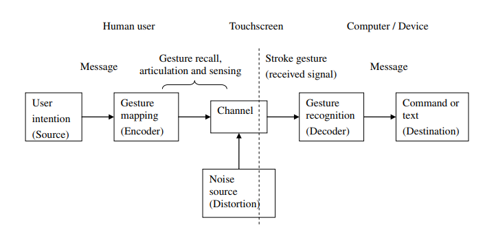</p>

**Figure 1:** Model of the end-to-end gesture typing process

In this work, we study the gestures produced when the encoding process $`E`$ results in an observed trajectory $`G`$ that stems from the user’s intention of connecting the keys corresponding to the characters of the word $`w`$, in the order in which they occur. The gesture corresponding to the word `MARCO`, for example, is generated from an initial touch on the key corresponding to the character `M`, sliding the pressed finger to the key `A`, from there to the key `R`, then to the key `C`, and finally lifting the finger on the key `O`. In this work, we use a monospaced font to denote characters and/or symbols of an alphabet.

In many cases, it is useful to give as input to the estimator $`D`$ a transformation of $`G`$, $`e : G \rightarrow \mathbb{R}^{d \times T}`$, where $`d`$ is the number of features used and $`T`$ the duration of the gesture. In this way, $`e`$ is a feature extractor for $`G`$. In this work, we implement a probabilistic feature extractor inspired by Quinn and Zhai (2018). This extractor is described in detail in Section 3.2.

### 1.2 Objectives

The general objective of this work is to improve gesture recognition using a neural model, based on a proposal made in Alsharif et al. (2015). As specific objectives, we have the implementation of a neural gesture decoding model and of a gesture synthesis model.

### 1.3 Motivation

The estimator $`D`$ needed to decode typing gestures must be extremely robust to noise, because the encoding process $`E`$ is probabilistic, non-deterministic and susceptible to the introduction of perturbations at several stages, such as cognitive errors, motor system errors, posture and physical characteristics of the user (Quinn and Zhai 2018).

In recent years, many pattern and sequence recognition techniques have been replaced by neural techniques, such as fully connected networks, end-to-end convolutional networks (Wang et al. 2012) and end-to-end LSTM networks (Graves and Jaitly 2014). One of the reasons for this transition is the high noise tolerance of these models. Since neural models are universal function approximators (Hornik 1991), they become strong candidates as estimators for $`D`$.

In cases where such functions have strong temporal dependence, i.e. the observation at time $`t`$ is strongly coupled to the observation at time $`t + 1`$ from the point of view of pattern classification, recurrent networks are usually applied, as they have a residual temporal connection that allows the model to “remember” previous inputs (Goodfellow et al. 2016).

However, due to the exploding/vanishing gradient problem that arises from cascaded backpropagation through time, traditional recurrent networks are not widely used (Pascanu et al. 2012). Instead, we use *Long Short-Term Memory* neural networks, which use continuous *gates* to erase or write the internal state of the cell, keeping the explosion and/or vanishing of the gradient under control (Hochreiter and Schmidhuber 1997). Therefore, building on the work of Alsharif et al. (2015), we apply LSTM networks to the gesture decoding problem, using a CTC (*Connectionist Temporal Classification*) cost function to deal with unsegmented sequences (Graves et al. 2006).

### 1.4 Main contributions

As a result of this work, besides the learning process of proposing and developing a project in a research and end-of-course context, we provide the following contributions:

- An open-source implementation of a gesture synthesis model for training models, based on Quinn and Zhai (2018), described in Section 3.3.

- An open-source implementation of a gesture decoder model using LSTM recurrent networks with a CTC cost function and Trie search with *Beam Search*, based on Alsharif et al. (2015; Graves and Jaitly 2014), described in Section 3.1.

- A probabilistic model for a feature extractor $`e`$, derived from Quinn and Zhai (2018), described in Section 3.2.

## 2 Theoretical background and literature review

In this chapter, we present the basic concepts needed to understand this work and describe related work. In particular, we cover topics related to gesture typing, LSTM recurrent networks, the CTC cost function, Tries, Beam Search and gesture synthesis models.

### 2.1 Gesture typing

Although studies with touch-centered interfaces have existed since the early 1990s (Chatty and Lecoanet 1996; Pedersen et al. 1995; Wolf and Rhyne 1993), along with some commercial attempts to introduce the touchscreen to the general public, such as the start-up GO and the Casio DB-1000 watch, the success of Blackberry smartphones made physical keyboards the dominant means of text entry on mobile phones in that period.

Around the same time, Palm devices, which adopted pen-operated touch-sensitive screens, introduced their Graffiti technology (Hawkins et al. 2002), inspired by the work of Goldberg and Richardson (1993), in which the user used a single stroke to represent a letter.

These first methods worked at the character level, assigning a single gesture to each of the available symbols. In their work, Goldberg and Richardson (1993) build a vocabulary of gestures from 5 basic types of stroke. By varying orientation and direction, up to 40 distinct symbols could be recognized. An example of gesture typing using Unistrokes is shown in Figure 2.

In these approaches, although the gesture prototypes were designed to resemble the symbols of the alphabet, this was not always possible, and their abstract nature required users to memorize associations between gesture and character that might not be obvious.

Later improvements, still character-based, appeared afterwards, such as Jot and Graffiti 2 (Sears and Arora 2002), which allowed multiple strokes, resolving the ambiguities introduced by the symbols *f*, *j* and *x*, for example.

<p align="center">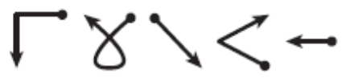</p>

**Figure 2:** Example of the word FORCE written using Unistrokes

Despite these advances, it was only in the late 2000s that the launch of the iPhone by Apple popularized the everyday use of mobile devices with *touchscreen* interfaces. It is believed that the inability of earlier hardware to provide a good user experience may have been the cause of the late adoption of devices with touch-based interaction.

The touch keyboard used on modern *touchscreen* smartphones usually has the QWERTY layout, and is deliberately modeled to resemble the physical object (Sutskever et al. 2013), in form and interaction, reducing the learning curve. Figure 3 shows an example of such a keyboard. The user enters a word by touching, with the fingers or a pointing device, the cell of the virtual button matrix corresponding to the character they want to enter, one at a time.

<p align="center">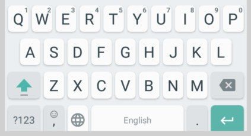</p>

**Figure 3:** Modern *touchscreen* keyboard

Due to their more flexible nature, touch-sensitive devices allow a much wider range of interaction methods than their physical equivalents. This work explores gesture-based interaction mechanisms, which are better suited to the constraints of mobile applications; in particular, methods for text entry based on gesture patterns.

In traditional touch interfaces, the user normally uses zero-order strokes (according to the taxonomy of Zhai et al. (2012)) to type. Since the user needs to hit an individual contact point for each character they want to enter, these methods are inherently slow. This is because these methods aim to emulate the interaction on a physical keyboard, in order to reduce the learning curve.

Systems such as Jot, Graffiti and Unistroke, although they brought interesting advances such as visual-spatial independence (Zhai et al. 2012) and used first- and higher-order gestures, were still slow because they were character-based.

The Quikwriting method for *stylus* interfaces was introduced in the late 1990s and used quadrants with grouped letters for the user to connect (Perlin 1998). In this system, gestures started and ended in the same resting zone in the center, and a simple table-lookup algorithm was used to perform recognition based on the *(x, y)* position of the cursor and control (*shifting*) quadrants. Quikwriting was based on first-order gestures and allowed writing both words and characters. However, due to its *design*, it was fundamentally a character entry method.

<p align="center">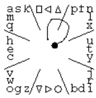</p>

**Figure 4:** Quikwriting method typing the letter *f*

In the same year, Mankoff and Abowd developed the first word-level gesture keyboard, called Cirrin (Mankoff and Abowd 1998), using a radial *layout* and arranging the letters so as to minimize the distance traveled by the pen on the surface. Their work focused on interaction methods for people with special needs or motor difficulties.

<p align="center">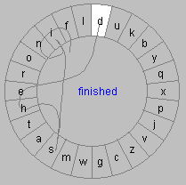</p>

**Figure 5:** Cirrin used to type the word *finished*

In 2003, Zhai and Kristensson introduced a word-level gesture keyboard with a horizontal layout, also using first-order gestures (a single stroke) (Zhai and Kristensson 2003). The authors, inspired by the proximity of some letters in English words or word segments on the keyboard, envisioned a technique in which the user could type by connecting the desired cells of the matrix with a single stroke. In their work, Zhai and Kristensson draw a parallel between this form of writing and stenography.

This method, called SHARK, short for *Shorthand Aided Rapid Keyboarding*, adopted a layout different from QWERTY called ATOMIK (Zhai et al. 2002), whose purpose was to bring closer the keys that appear in frequent English bigrams and to minimize the average length of the stroke required to enter a word.

<p align="center">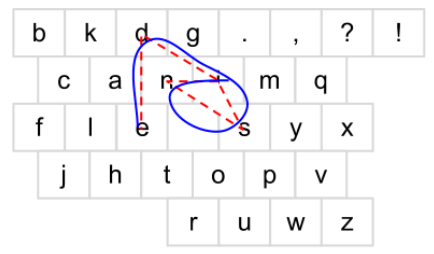 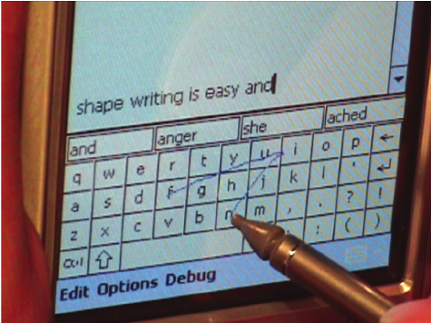</p>

**Figure 6:** ATOMIK layout (left) and *stylus* typing (right)

Although SHARK is often regarded as the first horizontal gesture typing keyboard, the work of Montgomery (Montgomery 1982) in 1982 can be considered the seminal work on gesture typing. Although his device was physical and the feasibility of implementing his work was doubtful given the technology of the time, the authors of Zhai and Kristensson (2012) recognize him as a researcher ahead of his time, a pioneer of this type of interaction, and lament his limited impact in the 20 years following the publication. The *wipe* keyboard, as Montgomery called his method, used a frequency-based layout like ATOMIK.

<p align="center">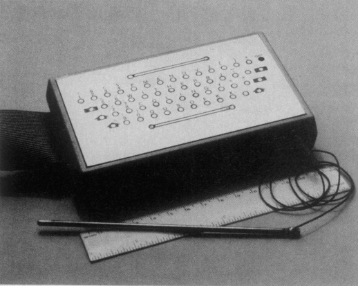</p>

**Figure 7:** Montgomery’s *wipe*-activated keyboard

One of the problems with the horizontal layout noticed by the authors of SHARK was ambiguity, which was practically nonexistent in *layouts* such as Quikwriting and Cirrin. Even so, the horizontal layout made better use of space, eliminating the need for a resting zone. The following year, Zhai and Kristensson presented SHARK2 (Kristensson and Zhai 2004), an extension of their first work, with improvements to the recognition algorithms, a larger vocabulary and optimizations of their original *design*.

In the following years, several commercial realizations of these studies appeared, already adopting the QWERTY layout and making the technology available to the general public. Notable among them are the keyboards implemented by ShapeWriter, SlideIT, Swype, T9 Trace, FlexT9, TouchPal, SwiftKey and Google. These companies combined the pattern recognition techniques already in use with language models[^2] to make more accurate predictions and thus reduce the error rate and increase the number of words per minute an average user could type. In this way, gesture typing keyboards became popular and are today built in as the default input method in the most widely used mobile operating system, Android.

### 2.2 Recognition algorithms

Gesture recognition is an example of multidisciplinary research. There are different tools for gesture recognition, and the methods range from statistical modeling, computer vision and pattern recognition to image processing and connectionist systems (Mitra and Acharya 2007). In general, solutions to the gesture recognition problem are based on statistical modeling, such as PCA, Hidden Markov Models, Kalman filters, particle filters and condensation algorithms. Even finite state machines have been effectively employed to model human gestures (Mitra and Acharya 2007).

Computer vision and pattern recognition techniques involving feature extraction, object detection, clustering and classification have also been used successfully in many gesture recognition systems (Mitra and Acharya 2007). Image processing techniques such as shape, texture, color, motion and optical flow analysis and detection, image enhancement, segmentation and contour modeling have also proven effective. Connectionist approaches, involving *multi-layer perceptrons*, *time-delay neural networks* and radial basis function networks, have also been used in gesture recognition (Mitra and Acharya 2007).

In early works, such as that of Zhai and Kristensson (2003), the authors use known cursive handwriting recognition techniques to decode gestures. In the SHARK keyboard, a dynamic programming algorithm called *elastic matching* was implemented to match the prototypes of the vocabulary words (ideal paths) to the user’s gesture, thereby computing $`P(w \mid G)`$.

Among the techniques used in cursive handwriting recognition applied to gesture decoding, we can mention preprocessing techniques such as *smoothing*, *filtering*, *stroke connection* and normalization, and recognition techniques such as feature-based decision trees, visual-temporal sequences, *template* matching, *dynamic time warping* and analysis by synthesis (Tappert et al. 1990).

Although such techniques achieved relative success, with the increasing computing capacity of mobile devices, together with the development of increasingly sophisticated machine learning techniques, classical methods have been set aside in favor of deep connectionist approaches, such as LSTMs, which we cover in this work.

### 2.3 LSTM networks

Recurrent networks are a specific type of neural network introduced in the 1980s to solve problems involving sequences. Due to a residual temporal connection to an internal state on which the output at each time $`t`$ depends, this type of architecture allows the neural network to use an input from time $`t-m`$ to produce its output at time $`t`$. Figure 8 shows a recurrent network unrolled in time. The recurrence is unrolled into a succession of copies of the network, in which the output information at time $`t`$ is provided as an additional input to the next copy at time $`t+1`$. In the end, both the input and the output of the network correspond to time series of inputs and outputs.

<p align="center"></p>

**Figure 8:** Diagram of a recurrent network

Neural methods estimate their target function through gradual adjustments of their parameters. These adjustments are made using a variant of gradient descent, the *backpropagation* algorithm. This parameter adjustment method was introduced by Rumelhart et al. (1986). In short, this method updates the weights of the neural network through a perturbation technique, represented by Equation 2.1:

``` math
W \rightarrow W' = W - \eta \delta \frac{\partial{\sigma(C)}}{\partial{W}} X \tag{2.1}
```

where $`W`$ is the weight matrix of a layer related to the connections between the inputs $`X`$ of the layer and its constituent cells, $`\delta`$ is the vector of credits (or blame) related to these cells, indicating how responsible they are for the current error of the model, $`\eta`$ is the learning rate and $`C`$ is the cost function, or error function, modified by an activation function $`\sigma`$. The learning rate establishes how large a step the algorithm takes during the iterations performed to find the minimum of the error surface described by $`\sigma(C)`$. In turn, the activation function $`\sigma`$ introduces a nonlinear transformation of $`C`$. Due to their unrolling in time, recurrent networks usually suffer from the vanishing/exploding gradient problem (Pascanu et al. 2012), which makes their training extremely complex.

This happens when the matrix $`W`$ is updated many times in the same propagation, making its value tend to $`0`$ or to infinity. To solve this problem, LSTM networks introduce new weight matrices responsible for erasing, reading or writing the internal state of the cell, which keeps the gradient under control during backpropagation.

<p align="center">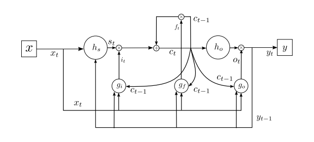</p>

**Figure 9:** Diagram of an LSTM cell

Formally, for each input $`x \in \mathbb{R}^{d \times T}`$, the LSTM cell computes the following function:
``` math
\begin{aligned}&s_t = h_s(W_s(y_{t-1} + x_t)) \\
&i_t = g_i(W_i(y_{t-1} + x_t + c_{t-1})) \\
&f_t = g_f(W_f(y_{t-1} + x_t + c_{t-1})) \\
&c_t = i_t \odot s_t + c_{t-1} \odot f_t \\
&o_t = g_o(W_o(x_t + y_{t-1} + c_t)) \\
&y_t = o_t \odot h_o(c_t)\end{aligned}
```

where $`W_s`$, $`W_i`$, $`W_f`$, $`W_o`$ are the weight matrices that control, respectively, the internal state, the input gate, the forget gate and the output gate. $`h_i`$, $`g_i`$, $`g_f`$, $`g_o`$ are the activation functions over, respectively, the state, the input, the forget gate and the output gate. Finally, $`c_t`$, $`s_t`$, $`y_t`$ are the final state, the candidate state and the output of the network at time $`t`$. Figure 9 shows a diagram with the relationship between all these variables. During training, the model learns how to use the gates to remember information from the past, which in practice makes it more robust to the vanishing and exploding gradient problem, in addition to providing a certain capacity for arbitrary memorization of the observed signals.

In some situations it can be useful to process the sequence in both “directions”, i.e. both in the order in which the data was produced, $`x = [x_1, x_2, x_3, ..., x_T]`$, and in the opposite order, $`x = [x_T, x_{T-1}, x_{T-2}, ..., x_1]`$. In this case, we use two LSTM networks, each processing $`x`$ in one direction, and for each time $`t`$ we combine the output of both. Several combination functions can be used between the two LSTMs, such as element-wise multiplication, concatenation and element-wise mean, among others. These RNNs are known as bidirectional LSTMs. In our work, we combine the output of the two networks using element-wise sum.

### 2.4 *Connectionist Temporal Classification*

There are many cost functions used in neural networks. In general, the cost function depends on the task to be performed. In classification problems – for example – cross-entropy is commonly used (Shore and Johnson 1980); in numerical approximation problems, squared error; in addition to many others, such as weighted loss functions.

In this work, building on Alsharif et al. (2015), we use the *Connectionist Temporal Classification* cost function (Graves et al. 2006), a function focused on labeling unsegmented temporal sequences. The CTC function is chosen because it is generally very laborious to align, segment and label sequences.

In our context, we want to map an input sequence $`G =`$ $`[g_1`$, $`g_2`$, $`g_3`$, $`..., g_t, ..., g_T]`$ into an output sequence $`w = [c_1, c_2, c_3,  ..., c_j, ..., c_m]`$, where $`G`$ is the user’s gesture, $`T`$ the length of the gesture, $`w`$ a word made of characters $`c_j \in \Sigma`$, and $`m`$ the length of $`w`$. We can observe three problems here: both $`m`$ and $`n`$ can vary; the ratio between $`m`$ and $`T`$ can vary; and we do not know an alignment (mapping) between a given $`g_t`$ and its corresponding $`c_j`$.

The CTC cost function solves this problem by introducing a new output class for the neural network – the blank symbol $`\lambda`$ – and computing the probabilities for each combination of the symbols of the output alphabet $`\Sigma \cup \{\lambda\}`$. Computing the probability of every possible output combination quickly becomes computationally intractable, but it can be solved satisfactorily with a dynamic programming algorithm (Graves et al. 2006).

In this way, the probability of a word $`w`$ given a gesture $`G`$ is given by:
``` math
P(w \mid G) = \sum_{A \in A_w} \prod_{t=1}^{T} p_t(c \mid G), \tag{2.8}
```
where $`A_w`$ is the set of valid alignments (Graves et al. 2006) of $`w`$ and $`p_t(c \mid G)`$ is the probability of a given character or of the blank symbol at time $`t`$, estimated by our recurrent network. As shown by Graves et al. (2006), the whole function is differentiable, so we can train a neural network to minimize $`-log(P(w \mid G))`$ using gradient descent.

### 2.5 Finite state transducers and *Beam Search*

After training, at inference time the LSTM produces a matrix $`y \in \mathbb{R}^{|\Sigma^+| \times T}`$, where $`\Sigma^+`$ is $`\Sigma \cup \{\lambda\}`$ and $`T`$ is the length of the gesture. The value $`y_{i, j}`$ of the matrix is the probability that the element of $`\Sigma^+`$ with index $`i`$ corresponds to the input $`G`$ at time $`j`$. This matrix indicates the correlation between $`G`$ and $`\Sigma^+`$.

One way to decode the output of the network is to take $`\operatorname*{arg\,max}_i y_{i,j}`$ for every time $`j`$, concatenating the corresponding characters $`c_j`$ to form a word $`w`$. However, this method does not always give us words belonging to the vocabulary $`L`$ of valid words.

<p align="center">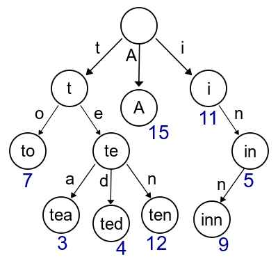</p>

**Figure 10:** Example of a Trie

Thus, to constrain the output of the network, we can take our lexicon and, from it, build a finite state transducer (FST) in the form of a *Trie*. Figure 10 shows an example of a Trie for the words {`TO, TEA, TED, TEN, A, I, IN, INN`}. As shown, in the Trie the edges denote characters of the words. The numbers in blue indicate the costs of the path to a node associated with a word observed in the dictionary. Such costs can be estimated in different ways and may represent, for example, how likely that word is. By construction, the Trie only allows processing prefixes of words seen in the dictionary, which avoids unnecessary estimates.

At decoding time, we use the output of the network to assign probabilities to the transitions of the FST. That is, the edges between two nodes of the Trie are weighted according to the probability of the sequence being observed by the LSTM. We can then walk through the Trie, keeping an estimate of the $`k`$ most likely words in the graph, using the classic breadth-first search algorithm *Beam Search*. One way to implement this algorithm in the context of LSTMs is described in detail by Graves and Jaitly (2014). Note that, in this case, we can say that the Trie turns the LSTM into a more sophisticated language model, by incorporating information from a lexicon. If we also incorporate into the Trie’s cost estimate the probability of the word occurring in the dictionary, this approach integrates a unigram language model into the recognition model.

### 2.6 Gesture synthesis models

Training a deep neural network generally requires a massive amount of data, which is not always easily accessible. Therefore, whenever possible, one tries to artificially augment the data (*data augmentation*). When working with images, it is possible to perform cropping, certain rotations, noise addition and mirroring, among other modifications (Krizhevsky et al. 2012). When working with audio, it is common to modify the *pitch*, volume and speed of the samples, for example (Graves and Jaitly 2014).

Another approach is to model the process that generates the data (*data generation*), which allows producing as many training examples as desired. The generating algorithms used must be sufficiently good approximators of the generated phenomena (*end-effectors*). Usually they do not cover the whole generating process – after all, if we had a faithful and complete generative model, a recognition model could easily be derived from the synthesis model.

In our problem, we seek to obtain data from gesture synthesis models. These models try to produce gesture samples with the highest possible correlation with data observed in the real world, using optimization and control techniques (Quinn and Zhai 2018). Details of the gesture synthesis algorithm used in this work, together with a more comprehensive mathematical and theoretical foundation, can be found in Section 3.3.

## 3 Gesture Synthesis and Decoding

In this chapter, building on the theoretical background discussed in Chapter 2, we describe the decoder model used in this work to solve the gesture typing problem. We also present our new probabilistic feature extraction method, discussing the input and output architecture of the network. Finally, we present the gesture synthesis model that will be used to train our decoder.

The model used in this work is a reproduction of the gesture typing decoding work proposed by Alsharif et al. (2015). However, there are some modeling differences. In short:

- Alsharif et al. (2015) does not use a feature extractor (Section 3.2) at training/inference time, while we do;

- Alsharif et al. (2015) uses an LSTM hidden layer of 400 neurons, while we use 512;

- Consequently, the model of Alsharif et al. (2015) has 1.5 million parameters, while ours has 2.2 million.

Apart from that, in terms of methods, the same techniques are kept, such as the use of the CTC cost function, *Beam Search* over the vocabulary Trie and the use of the LSTM output probabilities to assign probabilities to the resulting FST.

### 3.1 LSTM network with CTC cost

In this section we describe our implementation of an estimator for $`P(w \mid G)`$, based on the work of Alsharif et al. (2015). We use an LSTM neural network with a CTC cost function, and train it on a dataset of artificially generated gestures following the algorithm described in Section 3.3.

The neural network we use is a bidirectional LSTM with a single cell, with $`W`$ (internal state) matrices of dimension **512**. The input to the network is a sequence of observations obtained from the feature extractor described in Section 3.2 for each time $`t`$ of a gesture $`G`$. Figure 11 shows a diagram that details the model graphically.

<p align="center">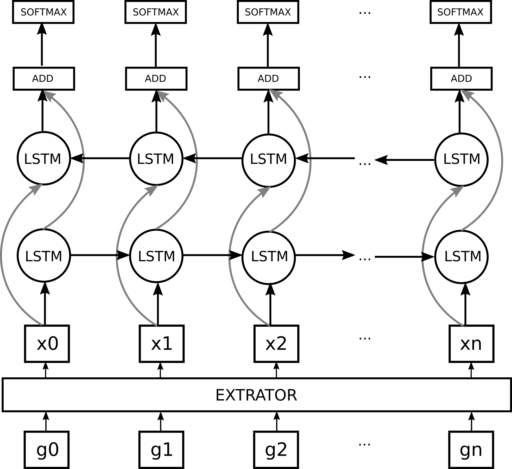</p>

**Figure 11:** Diagram of the bidirectional model

The output of the estimator is, for each time $`g_t`$, the probability that an element of $`\Sigma^+`$ corresponds to the correct decoding of $`G`$ at time $`t`$. These probabilities are computed using the *softmax* function on the output of the network for each $`t`$. The final result is a matrix $`y \in \mathbb{R}^{|\Sigma^+| \times T}`$, where $`T`$ is the length of the gesture. This matrix corresponds to the network’s decoding of the gesture $`G`$, independent of a language model.

We apply the matrix $`y`$ as the transition probabilities (edges) of an FST built from a Trie of the dictionary. This FST is used by the *Beam Search* algorithm to emit the sequences with the highest accumulated probability mass found in a search of width $`k`$. In our work, $`k = 3`$. Figure 12 presents the end-to-end decoding as a diagram.

<p align="center">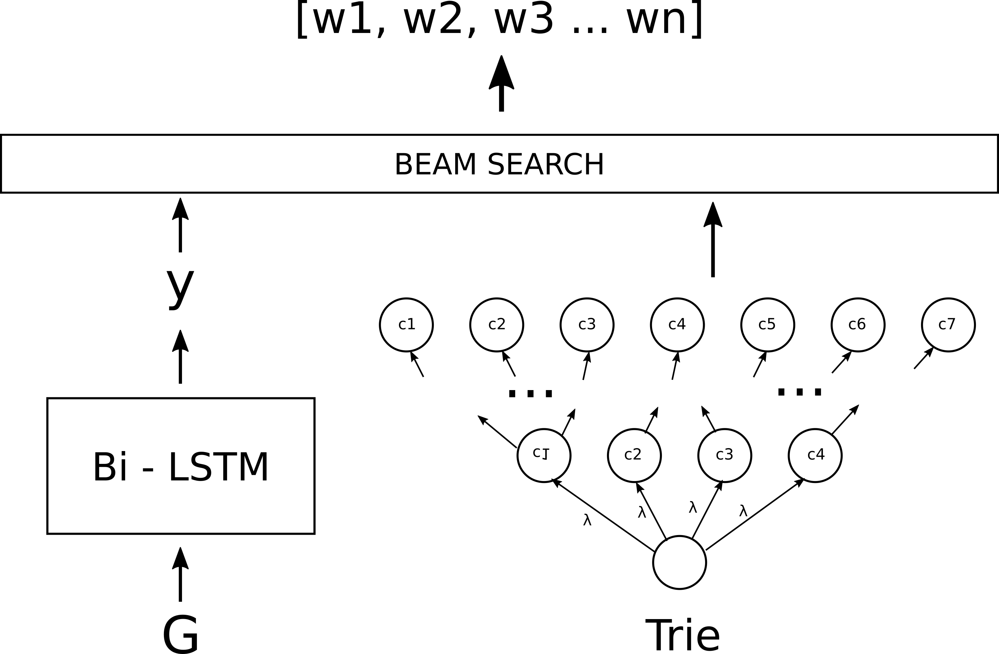</p>

**Figure 12:** Diagram of the end-to-end decoding model

### 3.2 Feature extractor

As shown in Quinn and Zhai (2018), the typing process has a structural error, modeled in Section 3.3 by $`s_1`$. Thus, the noise source (motor, bioelectrical or cognitive) causes the values observed when the user intends to hit a given key to follow a distribution $`\mathcal{N}(m(\omega_i), s_1)`$, where $`m(\omega_i)`$ is the midpoint of the key the user wanted to hit.

Therefore, it is only natural that, when feeding the LSTM estimator during training and inference, we use not the discrete information of which key is hit at time $`t`$ (a *one-hot vector*) in a gesture $`G`$, as in Alsharif et al. (2015), but rather the probability of each key being the one the user wanted to hit at time $`t`$.

Assuming that the probability of each key being the intended key is independent of the probability of the other keys being the intended key, we define the input of the network at training and inference time as the matrix $`X \in \mathbb{R}^{|\omega| \times T}`$, where each element is
``` math
X_{i, t} = P(\omega_i \mid g_t), \tag{3.1}
```
where $`\omega_i`$ is a key of the virtual keyboard, $`\omega`$ the set of possible keys and $`g_t`$ the coordinates of the user’s finger or pointing device at time $`t`$, as described in Section 1.1. In our work, $`|\omega|`$ is **26**.

Quinn and Zhai (2018) observed that the data follow a normal distribution centered at the midpoint of the key, $`m(\omega_i)`$. Therefore, we model the probability of each key being the key intended by the user at time $`t`$ as inversely proportional to the distance between $`g_t`$ and $`m(\omega_i)`$, and we can compute it as

``` math
P(\omega_i \mid g_t) = \frac{1}{e^{\left\lVert m(\omega_i) - g_t\right\rVert \delta}}, \tag{3.2}
```
where $`\delta`$ is the structural error coefficient.

The structural error coefficient $`\delta`$ is chosen so as to represent the constraints of the interface and to best model the likely errors. It is related to $`s_1`$, and is also conditioned on other variables, such as screen size and stroke speed. In our work, we use $`\delta = \frac{1}{4s_1} = 0.025`$. Figure 13 shows a comparison between the input model used in Alsharif et al. (2015) and two different parameterizations of our feature extractor.

<p align="center">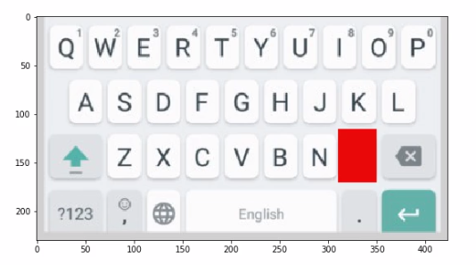 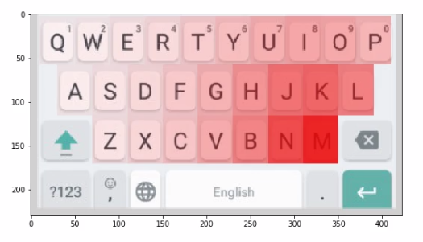 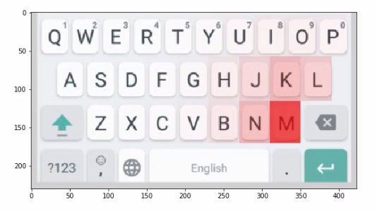</p>

**Figure 13:** Clockwise: one-hot modeling (Alsharif et al. 2015), $`\delta = 0.01`$ and $`\delta = 0.025`$ for the same point $`g_t`$

With our modeling, the resulting matrix $`X`$ contains the information about the trajectory $`G`$ as a function of the probabilities of the user’s intention at each time, making it possible to encode uncertainty, such as when $`g_t`$ lies on the border between two keys, by assigning equal probabilities to both adjacent keys. This matrix is used as the network input at training and inference time, instead of $`G`$.

In addition to the boolean (*one-hot*) vector, Alsharif et al. (2015) also uses other values as network inputs, such as the $`(x, y)`$ coordinate, the gesture type and the time since the last gesture. These variables do not need to be used in our model.

### 3.3 Synthesis

To train our estimator model, we need a massive amount of data. Therefore, considering that obtaining usability data for the keyboard used would be an extremely complex process, we decided to implement a gesture synthesis model capable of generating training data on demand.

This section describes a model and an algorithm for synthesizing human gestures based on the work of Quinn and Zhai (2018). This model covers only the observable variables of an observed trajectory $`G`$ (*end-effector*), and does not aim to model the whole latent biomechanical and bioelectrical process that generates the movement. The authors obtained the synthesis model from a segmentation algorithm that derives parameters for the encoding process $`E(w)`$ described below.

Let $`\Sigma`$ be the set of characters allowed in the words of a vocabulary $`L`$, and each word $`w = \{ c_1, c_2, c_3, ..., c_n : c_i \in \Sigma \}`$ an ordered sequence of characters. Assuming that $`w`$ is any word in $`L`$ that the user wants to type – such as `MARCO` – for each symbol $`c`$ in $`w`$ there is a key $`\omega_c`$ corresponding to it on the virtual keyboard. `Ã`, `Á` and `A` all have $`\omega_c`$ = $`\omega_\texttt{A}`$, for example. The mapping $`\omega`$ is generally given by the implementation of the virtual keyboard.

We define $`m : \Omega \rightarrow \mathbb{R}^2`$ as the function

``` math
m(\omega_c) = \bigg[  \frac{x_2^{\omega_c} - x_1^{\omega_c}}{2} \ \frac{y_2^{\omega_c}- y_1^{\omega_c}}{2} \bigg], \tag{3.3}
```
where $`(x_1^{\omega_c}, y_1^{\omega_c}), (x_2^{\omega_c}, y_2^{\omega_c})`$ are the coordinates of the points corresponding to the corners of a key $`\omega`$ that represents the character $`c`$, and $`\Omega`$ is the set of keys available on the virtual keyboard.

Let $`K`$ be the real matrix representing the coordinates of the centroids of each key that must be pressed to enter $`w`$ on a conventional keyboard. Therefore, $`K = [ \mathbf{k}_1, \mathbf{k}_2, \mathbf{k}_3, ..., \mathbf{k}_n]^T`$ and $`\mathbf{k}_i = m(\omega_{c_i})`$. We also assume, as described in 1.1, that the user’s intention is to connect the points indicated by $`K`$, in order. This matrix forms the prototype of the gesture, as shown in Figure 14.

<p align="center">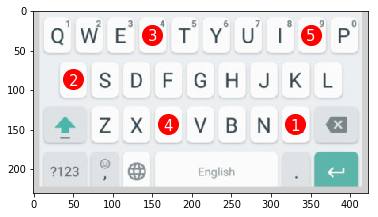</p>

**Figure 14:** Graphical representation of the matrix $`K`$ for the word `MARCO`

However, as shown in Quinn and Zhai (2018), due to the motor and cognitive error of the encoding process, the user does not always hit the key centroids precisely. Thus, the values actually observed in experimental data follow a normal distribution, so that the observation matrix $`O`$ is a realization of a distribution $`\mathcal{N}(K, s_1)`$, where $`s_1`$ is the spread coefficient. Figure 15 shows the influence of $`s_1`$ on the dispersion of the samples of $`O`$ around $`K`$. In our synthesis experiments, we use $`s_1 = 10`$.

<p align="center"> 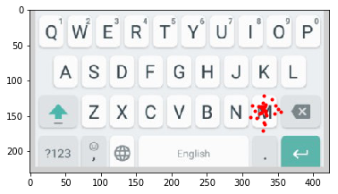 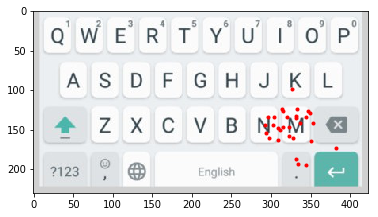</p>

**Figure 15:** Example realizations of $`O`$ for $`s_1 = \{5, 10, 20\}`$ from left to right, with $`K_i = m( \texttt{M})`$

Quinn and Zhai (2018) noticed in experimental data that real trajectories rarely followed the prototype in a straight line; instead, they showed small curvatures along the trajectory. The authors observed that the curvature followed a normal distribution, given by $`\theta \sim \mathcal{N}(0, {s_2}^{2})`$, where $`s_2`$ is the standard deviation of the trajectory curvature, with $`s_2 = 11.59^{\circ}`$. We therefore define $`Z = [ \mathbf{o}_1, \mathbf{v}_1, \mathbf{o}_2, \mathbf{v}_2 , \mathbf{o}_3, \mathbf{v}_3, ..., \mathbf{v}_{n-1}, \mathbf{o}_n ]^T`$, where

``` math
\mathbf{v}_i = \frac{(\mathbf{o}_{i+1} - \mathbf{o}_{i})}{2} R(\theta) + \mathbf{o}_{i} \tag{3.4}
```

The matrix $`Z`$ represents the points of $`O`$ interleaved with the points of the matrix $`V`$. In turn, $`V`$ denotes the midpoint between any two consecutive points of $`O`$, perturbed by an angle $`\theta`$ after multiplication by a rotation matrix $`R(\theta)`$. The matrix $`V`$ represents the connecting points (*via-points*), which were found in the work of Quinn and Zhai (2018) to be the best anchors for recovering the original gesture, taking the curvature of the trajectory into account.

<p align="center">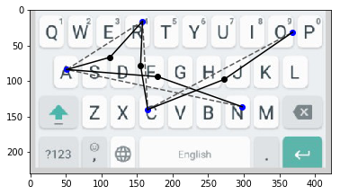</p>

**Figure 16:** Graphical example of a matrix $`Z`$, the result of interleaving $`O`$ (in blue) and $`V`$ (in black). The dashed line indicates the prototype of the trajectory between the points of $`O`$

According to Fitts (1954), the trajectory of human movement respects the principle of isochrony, which states that the duration of a movement is essentially independent of its amplitude. In 1985, Flash and Hogan (1985) applied the minimum *jerk* model to approximate human strokes and showed a correlation between the strokes generated by this model and strokes obtained experimentally, as well as its compatibility with the principle of local isochrony and the two-thirds power law of curvature.

The two-thirds power law (Viviani and Cenzato 1985) reflects the relationship between the tangential velocity of a movement and the radius of curvature at time $`t`$. It implies that equal angles are described in equal times, and that the velocity of a stroke evolves in inverse proportion to its curvature.

Based on the studies of the aforementioned authors, we define the sub-trajectory $`G_i`$ as the stroke that connects $`\mathbf{o}_i`$ to $`\mathbf{o}_{i + 1}`$ passing through $`\mathbf{v}_{i}`$ and that minimizes

``` math
C = \frac{1}{2} \int_{t_0}^{t_f} \bigg[ \bigg(\frac{d^3x}{dt^3}\bigg)^2 + \bigg(\frac{d^3y}{dt^3}\bigg)^2 \bigg] dx, \tag{3.5}
```
the cost function of the stroke $`G_i`$. This function represents the rate of change of acceleration (*jerk*) of the trajectory $`G_i`$ from $`t=t_0`$ to $`t=t_f`$. Consequently, minimizing $`C`$ maximizes the smoothness of the generated stroke.

Later, Viviani and Terzuolo (1982) observed data in their experiments suggesting that complex gestures are planned as a concatenation of several simpler primitives. With that, Viviani and Flash (1995) extended the minimum *jerk* theory to an arbitrary number of points, showing that the concatenation of minimum *jerk* paths successfully predicts human trajectories of various shapes, while remaining consistent with the two-thirds power law and the principle of local isochrony. In this way, the final trajectory $`G`$ is the concatenation of all sub-trajectories $`G_i`$ for $`i`$ from $`1`$ to $`n`$.

<p align="center">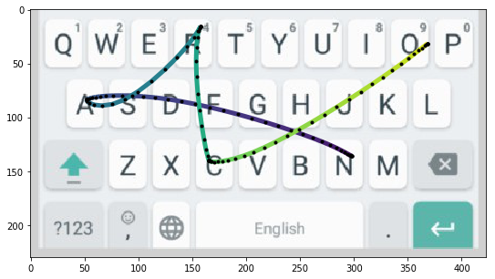</p>

**Figure 17:** Example of a trajectory $`G`$

Finally, the gesture synthesis algorithm consists of taking the word $`w`$; obtaining the centroids of the keys corresponding to each character; for each pair of centroids, in order, taking their midpoint and perturbing it by $`\theta`$ degrees with respect to the line between the two centroids; and finally building the minimum *jerk* trajectory that connects all the points, three at a time, concatenating them.

Formally:

**Algorithm 1:** Algorithm for synthesizing trajectories from w

1.  $`w\gets word`$

2.  $`K\gets m(\omega_{c_i})`$ for $`c_i`$ in $`w`$

3.  $`O\gets \mathcal{N}(K, s_1)`$

4.  $`\theta \gets \mathcal{N}(0, s_2)`$

5.  $`V \gets ((\mathbf{o}_{i+1} - \mathbf{o}_{i}) / 2) R(\theta) + \mathbf{o}_{i}`$ for $`i`$ from $`1`$ to $`|O| - 1`$

6.  $`Z \gets interleave(O, V)`$

7.  $`G \gets mjt(Z_i, Z_{i+1}, Z_{i + 2})`$ for $`i`$ from $`1`$ to $`|Z| - 2`$, with step 2

The function $`interleave(A, B)`$ interleaves two matrices $`A`$ and $`B`$, and the function $`mjt(p_1, p_2, p_3)`$ returns the minimum *jerk* path that connects $`p_1`$ and $`p_3`$ passing through $`p_2`$. In our work, we use the minimum *jerk* trajectory implementation by Yazdani et al. (2012), which uses the infinity norm instead of the Euclidean norm and solves the resulting convex optimization problem.

## 4 Experiments and Results

In this chapter we describe the experimental methodology adopted and the experiments carried out to evaluate the proposed models, including when applied to Portuguese data (for this purpose in particular, using transfer learning). We then discuss the results obtained, analyzing some errors of the method and their possible causes.

### 4.1 Experimental methodology

In this section we cover the vocabulary used and the training and evaluation procedures of the proposed models.

#### 4.1.1 Vocabulary

We use a lexicon of a little over 62 thousand words to train and validate the algorithms. This lexicon was obtained from the wbritish-insane package[^3], distributed with Debian Linux and used in several open-source programs. We preprocessed the words in order to remove proper nouns and words containing apostrophes. Examples of resulting words after this preprocessing include: {“CONSULAR”, “FILLERS”, “BLEACH”, “UPSURGED”, “CLAIMS”, “MARCHER”, “SERVICING”, “FOLKSIEST”, “EGGPLANTS”, “MANIPULATOR”}. Figure 18 shows the distribution of word lengths in the lexicon used.

It is important to point out here that, in our reference work, Alsharif et al. (2015) uses a different training/evaluation dataset (*Enron*). The number of unique words in their dataset is approximately 8 thousand. In our case, we give our network a greater variety of words, in contrast with a smaller variety of gestures for each word.

<p align="center">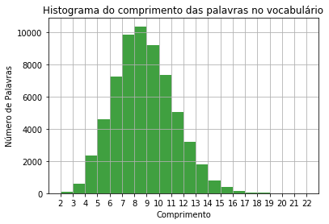</p>

**Figure 18:** Histogram of word lengths in the vocabulary

#### 4.1.2 Training

The model was trained in 3 rounds. For each round, we generated a synthetic trajectory $`G`$ for each of the 62,956 words of the vocabulary. We set aside the first 50 thousand trajectories for training and validating the network, and the rest for testing. In each round, we trained the network for 30 epochs. Thus, at test time, the network had not been trained on any of the words of the test set, nor, consequently, on the trajectories generated from them.

In their work, our *baseline* (Alsharif et al. 2015) trains the model on a dataset of 124 thousand gestures, against our 150 thousand. In addition, their model is tested on a set of 14 thousand instances, while ours is evaluated on a set of 12 thousand instances.

The network was trained using the open-source Keras stack, running on the TensorFlow *backend*, on 8 Tesla K80 GPUs in parallel on the same machine. Each training round, from synthesis to evaluation, took 12 hours on average. The *batch* size used was 2048, since we used data parallelism and each *batch* has its examples split equally among the 8 GPUs.

#### 4.1.3 Evaluation

At the end of the last training round, we evaluated the performance of the trained network with and without the Trie + *Beam Search*. Like Graves and Jaitly (2014), we consider the network correct when, after removing repeated characters and the symbol $`\lambda`$, the resulting word after decoding on the Trie using *Beam Search* (when applicable) is exactly the expected word. As evaluation metric, we use accuracy, that is, the proportion of correct answers over the total number of test cases. As test cases, we use 10% of the synthesized gestures, not used in the training and validation sets.

We also carried out an additional experiment with Portuguese words. For this specific case, we used as test set the 1000 most common Portuguese words on the web[^4]. From this list, we removed words with accents, which are not compatible with the last layer of the proposed network, trained for English. Note that the model can be extended to support these symbols simply by training the last fully connected layer of the network and using a training vocabulary.

### 4.2 Word recognition

Table 1 shows the accuracy of our word recognition model. In this table, *argmax* refers to using the output of the LSTM as the result of the classifier, without considering the Trie; *Trie* refers to the output of the LSTM considering the Trie; finally, *Trie-3* refers to the output of the LSTM considering the three most likely words according to the Trie. As we can see, using only the LSTM, without constraining the output of the method to the words in the dictionary with the Trie, the performance is already significant, with about 66% accuracy. However, when we introduce the language model provided by the FST/Trie using the probabilities obtained by the LSTM, the accuracy rises considerably to about 97%, a gain of more than 50%. When we consider correct any Trie estimate whose correct word is among the top-3 most likely, the result rises to about 98%.

**Table 1:** Results obtained on the test *dataset* in the final round

| ***Decoding* method** | **accuracy** |
|:----------------------|:-------------|
| argmax                | 65.51%       |
| Trie                  | 96.95%       |
| Trie-3                | 97.76%       |

### 4.3 The effects of the synthesizer on recognition errors

When evaluating the synthesizer used to produce training data, we noticed that, in some cases, the variance of the generated data can confuse the model at prediction time. Figures 19 to 23 show cases in which the model is confused by data from the generator.

<p align="center">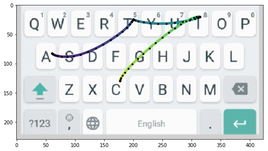 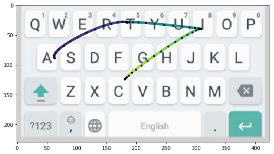</p>

**Figure 19:** Example trajectories for the word `ATTIC`. In the example on the left, the model decodes it correctly. In the one on the right, the recognized word was `SATIN`.

In many cases (**43.38**%) in which the network made a mistake at evaluation time, when the top-1 error cases were tested again with new synthetic gestures, the model was able to assign the highest probability to the correct word. This suggests that some of its errors came from outliers of the distributions of trajectory curvature (controlled by $`s_2`$) and keypoint position (controlled by $`s_1`$).

<p align="center">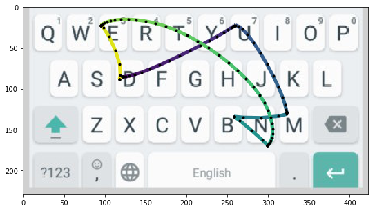 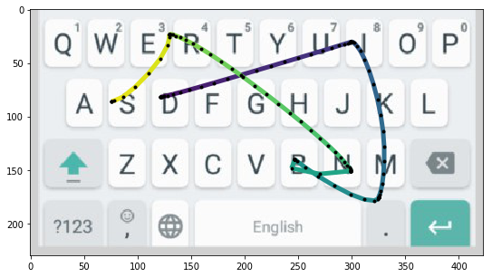</p>

**Figure 20:** Example trajectories for the word `DUMBNESS`. In the example on the left, the model decodes it correctly. In the one on the right, the recognized word was `DIMNESS`.

<p align="center">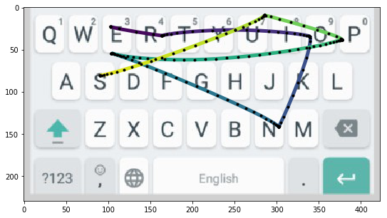 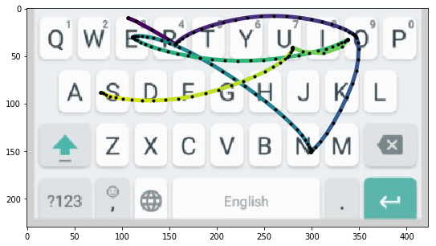</p>

**Figure 21:** Example trajectories for the word `ERRONEOUS`. In the example on the left, the model decodes it correctly. In the one on the right, the recognized word was `WRONGS`.

<p align="center">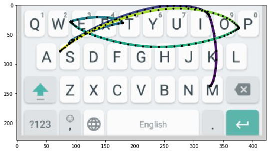 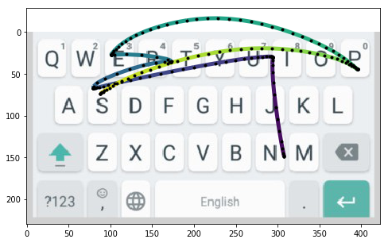</p>

**Figure 22:** Example trajectories for the word `MISSTEPS`. In the example on the left, the model decodes it correctly. In the one on the right, the recognized word was `MISTED`.

<p align="center">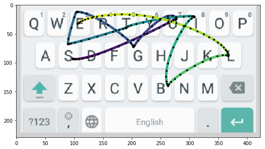 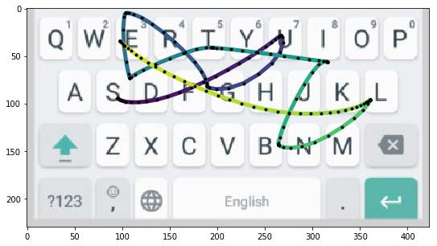</p>

**Figure 23:** Example trajectories for the word `SUGGESTIBLE`. In the example on the left, the model decodes it correctly. In the one on the right, the recognized word was `SUFFERING`.

Most of these errors could be corrected by a language model that considers the last $`n`$ words typed, such as a second LSTM that consumes the previous words and serves as input to the model, or a hidden Markov model. Adding language model information to the method is trivial and can be done by weighting the *Beam Search*, for example. Like Alsharif et al. (2015), we did not implement a more sophisticated language model.

### 4.4 Portuguese word recognition with transfer learning

It is also interesting to note that, in some cases of words outside the lexicon $`L`$ (*out-of-vocabulary*), when decoding the network output using argmax, the LSTM produces the expected output. However, when decoding on the constructed FST, the method produces the most likely word within $`L`$. This is the common and expected behavior in gesture typing systems.

This suggests that the model can be extended to recognize words in other languages – such as Portuguese – just by changing the lexicon used. As a proof of concept, we carried out a transfer learning test with 600 common Portuguese words, such as `JOGO`, `VOLTA`, `MINISTRO` and `DESENVOLVIMENTO`.

Transfer learning (Weiss et al. 2016) involves using the knowledge acquired by a model in one domain – in our case, converting gestures into English words – in another domain. In our experiment, the new domain is converting gestures into Portuguese words.

Using the set of the 1000 most common Portuguese words on the web, the model achieved an accuracy of **99.4**%. Figure 24 shows some of the trajectories for these words.

<p align="center">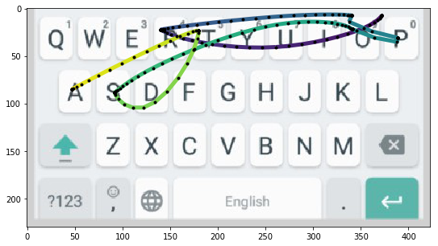 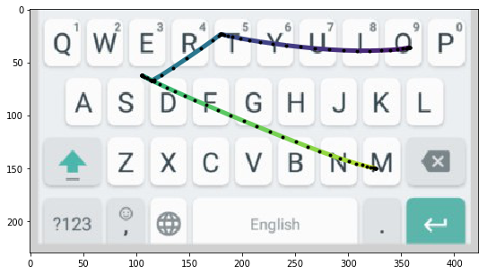 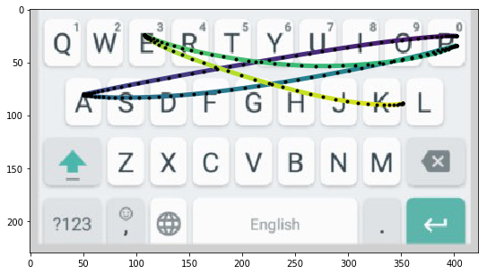 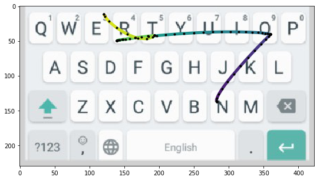</p>

**Figure 24:** Example trajectories for Portuguese words that were correctly classified. Clockwise, starting at the top left: `PROPOSTA`, `ORDEM`, `PAPEL` and `NORTE`.

## 5 Conclusion and future work

The gesture decoding problem is complex, but its solutions add a lot of value to human-computer interaction on mobile devices. In this work, we reviewed the literature on the problem of decoding gestures into words, its constraints, and the models and algorithms proposed to solve it. We implemented an LSTM neural network with a CTC cost function to estimate the probabilities of the mapping between gestures and characters, aided by the Trie and Beam Search in the decoding process.

We also implemented a generative model to produce synthetic training data, capable of producing examples similar to human trajectories, and used this data to train our model. This allowed us to train on a reasonable volume of examples, and we demonstrated the ability of LSTM networks to decode complex patterns in gesture sequences.

We carried out a proof of concept of transfer learning with the already trained model and observed a good generalization capacity. This suggests that the model can be extended to other languages – or problems – without the need for complete retraining.

Although we cannot compare ourselves directly with the study of Alsharif et al. (2015), due to differences in methodology, minor architectural differences, and access to their data and generative model, we believe that the probabilistic model for the feature extractor presented in Section 3.2 may be the reason for an improvement of **3.45%** when compared to their model on a synthetic dataset (*Enron*). This, of course, should be the subject of deeper investigation.

Among the many other models capable of solving the gesture typing problem, perhaps the most promising are those based on *Neural Machine Translation*. One of them in particular, the *Seq2Seq* architecture (Sutskever et al. 2014), could be an even more accurate estimator for the probabilities.

Finally, the presented model can be adapted to problems of a similar nature, such as recognizing words typed with the eyes. With minimal changes, our synthesis and recognition method can also be used to recognize generic gestures on mobile devices.

## References

Alsharif, Ouais, Tom Ouyang, Françoise Beaufays, Shumin Zhai, Thomas Breuel, and Johan Schalkwyk. 2015. “Long Short Term Memory Neural Network for Keyboard Gesture Decoding.” *Acoustics, Speech and Signal Processing (ICASSP), 2015 IEEE International Conference on*, 2076–80.

Chatty, Stéphane, and Patrick Lecoanet. 1996. “Pen Computing for Air Traffic Control.” *Proceedings of the SIGCHI Conference on Human Factors in Computing Systems*, 87–94.

Fitts, Paul M. 1954. “The Information Capacity of the Human Motor System in Controlling the Amplitude of Movement.” *Journal of Experimental Psychology* 47 (6): 381.

Flash, Tamar, and Neville Hogan. 1985. “The Coordination of Arm Movements: An Experimentally Confirmed Mathematical Model.” *Journal of Neuroscience* 5 (7): 1688–703.

Goldberg, David, and Cate Richardson. 1993. “Touch-Typing with a Stylus.” *Proceedings of the INTERACT’93 and CHI’93 Conference on Human Factors in Computing Systems*, 80–87.

Goodfellow, Ian, Yoshua Bengio, Aaron Courville, and Yoshua Bengio. 2016. *Deep Learning*. Vol. 1. MIT press Cambridge.

Graves, Alex, Santiago Fernández, Faustino Gomez, and Jürgen Schmidhuber. 2006. “Connectionist Temporal Classification: Labelling Unsegmented Sequence Data with Recurrent Neural Networks.” *Proceedings of the 23rd International Conference on Machine Learning*, 369–76.

Graves, Alex, and Navdeep Jaitly. 2014. “Towards End-to-End Speech Recognition with Recurrent Neural Networks.” *International Conference on Machine Learning*, 1764–72.

Hawkins, Jeffrey Charles, Joseph Kahn Sipher, and Marianetti II Ron. 2002. *Multiple Pen Stroke Character Set and Handwriting Recognition System with Immediate Response*. Google Patents.

Hochreiter, Sepp, and Jürgen Schmidhuber. 1997. “Long Short-Term Memory.” *Neural Computation* 9 (8): 1735–80.

Hornik, Kurt. 1991. “Approximation Capabilities of Multilayer Feedforward Networks.” *Neural Networks* 4 (2): 251–57.

Kristensson, Per-Ola, and Shumin Zhai. 2004. “SHARK 2: A Large Vocabulary Shorthand Writing System for Pen-Based Computers.” *Proceedings of the 17th Annual ACM Symposium on User Interface Software and Technology*, 43–52.

Krizhevsky, Alex, Ilya Sutskever, and Geoffrey E Hinton. 2012. “Imagenet Classification with Deep Convolutional Neural Networks.” *Advances in Neural Information Processing Systems*, 1097–105.

Mankoff, Jennifer, and Gregory D Abowd. 1998. “Cirrin: A Word-Level Unistroke Keyboard for Pen Input.” *Proceedings of the 11th Annual ACM Symposium on User Interface Software and Technology*, 213–14.

Mitra, Sushmita, and Tinku Acharya. 2007. “Gesture Recognition: A Survey.” *IEEE Transactions on Systems, Man, and Cybernetics, Part C (Applications and Reviews)* 37 (3): 311–24.

Montgomery, Edward B. 1982. “Bringing Manual Input into the 20th Century: New Keyboard Concepts.” *Computer* 15 (3): 11–18.

Pascanu, Razvan, Tomas Mikolov, and Yoshua Bengio. 2012. “Understanding the Exploding Gradient Problem.” *CoRR, Abs/1211.5063*.

Pedersen, Elin Rønby, Kim McCall, Thomas P Moran, and Frank G Halasz. 1995. “Tivoli: An Electronic Whiteboard for Informal Workgroup Meetings.” In *Readings in Human–Computer Interaction*. Elsevier.

Perlin, Ken. 1998. “Quikwriting: Continuous Stylus-Based Text Entry.” *Proceedings of the 11th Annual ACM Symposium on User Interface Software and Technology*, 215–16.

Quinn, Philip, and Shumin Zhai. 2018. “Modeling Gesture-Typing Movements.” *Human–Computer Interaction* 33 (3): 234–80.

Rumelhart, David E, Geoffrey E Hinton, and Ronald J Williams. 1986. “Learning Representations by Back-Propagating Errors.” *Nature* 323 (6088): 533.

Sears, Andrew, and Renee Arora. 2002. “Data Entry for Mobile Devices: An Empirical Comparison of Novice Performance with Jot and Graffiti.” *Interacting with Computers* 14 (5): 413–33. <https://doi.org/10.1016/S0953-5438(01)00060-1>.

Shore, John, and Rodney Johnson. 1980. “Axiomatic Derivation of the Principle of Maximum Entropy and the Principle of Minimum Cross-Entropy.” *IEEE Transactions on Information Theory* 26 (1): 26–37.

Sutskever, Ilya, James Martens, George Dahl, and Geoffrey Hinton. 2013. “On the Importance of Initialization and Momentum in Deep Learning.” *International Conference on Machine Learning*, 1139–47.

Sutskever, Ilya, Oriol Vinyals, and Quoc V Le. 2014. “Sequence to Sequence Learning with Neural Networks.” *Advances in Neural Information Processing Systems*, 3104–12.

Tappert, Charles C., Ching Y. Suen, and Toru Wakahara. 1990. “The State of the Art in Online Handwriting Recognition.” *IEEE Transactions on Pattern Analysis and Machine Intelligence* 12 (8): 787–808.

Viviani, Paolo, and Marco Cenzato. 1985. “Segmentation and Coupling in Complex Movements.” *Journal of Experimental Psychology: Human Perception and Performance* 11 (6): 828.

Viviani, Paolo, and Tamar Flash. 1995. “Minimum-Jerk, Two-Thirds Power Law, and Isochrony: Converging Approaches to Movement Planning.” *Journal of Experimental Psychology: Human Perception and Performance* 21 (1): 32.

Viviani, Paolo, and Carlo A Terzuolo. 1982. *On the Relation Between Word-Specific Patterns and the Central Control Model of Typing: A Reply to Gentner.*

Wang, Tao, David J Wu, Adam Coates, and Andrew Y Ng. 2012. “End-to-End Text Recognition with Convolutional Neural Networks.” *Pattern Recognition (ICPR), 2012 21st International Conference on*, 3304–8.

Weiss, Karl, Taghi M Khoshgoftaar, and DingDing Wang. 2016. “A Survey of Transfer Learning.” *Journal of Big Data* 3 (1): 9.

Wolf, Catherine G, and James R Rhyne. 1993. “Gesturing with Shared Drawing Tools.” *INTERACT’93 and CHI’93 Conference Companion on Human Factors in Computing Systems*, 137–38.

Yazdani, Mehrdad, Geoffrey Gamble, Gavin Henderson, and Robert Hecht-Nielsen. 2012. “A Simple Control Policy for Achieving Minimum Jerk Trajectories.” *Neural Networks* 27: 74–80.

Zhai, Shumin, Michael Hunter, and Barton A Smith. 2002. “Performance Optimization of Virtual Keyboards.” *Human–Computer Interaction* 17 (2-3): 229–69.

Zhai, Shumin, and Per Ola Kristensson. 2012. “The Word-Gesture Keyboard: Reimagining Keyboard Interaction.” *Communications of the ACM* 55 (9): 91–101.

Zhai, Shumin, Per Ola Kristensson, Caroline Appert, Tue Haste Anderson, Xiang Cao, et al. 2012. “Foundational Issues in Touch-Surface Stroke Gesture Design—an Integrative Review.” *Foundations and Trends® in Human–Computer Interaction* 5 (2): 97–205.

Zhai, Shumin, and Per-Ola Kristensson. 2003. “Shorthand Writing on Stylus Keyboard.” *Proceedings of the SIGCHI Conference on Human Factors in Computing Systems*, 97–104.

[^1]: A model for $`E`$ is discussed in detail in Section 3.3

[^2]: A model describing a language that allows inferring information of interest about it, such as the probability of a word occurring given that one or more words were previously observed

[^3]: Available at https://packages.debian.org/sid/wbritish-insane, accessed on 06/11/2018

[^4]: Words obtained from http://hackingportuguese.com/sample-page/the-1000-most-common-nouns-in-portuguese/, accessed on 06/12/2018
